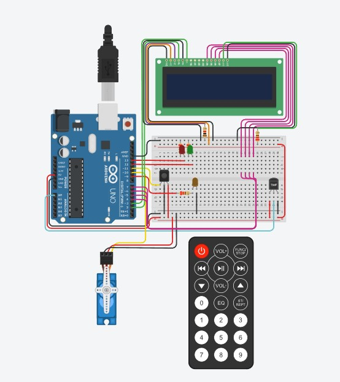
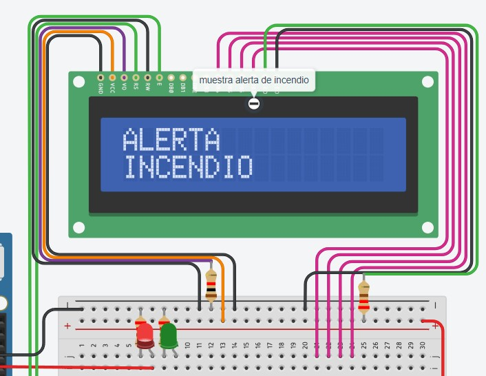
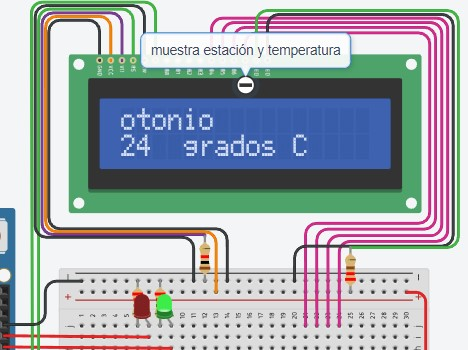
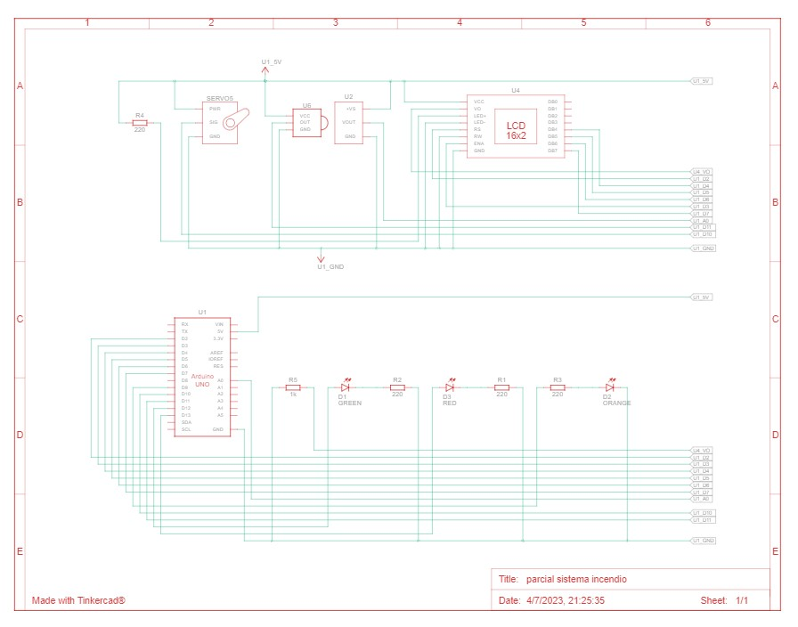

# Parcial (Parte práctica)
--------------------------------------------------------------
## Proyecto: SISTEMA DE INCENDIO

imagen de Tinkercad:

## Alumno:
* Josue Damacio

## Descripción:
#### Este proyecto tiene el objetivo de diseñar un sistema de incendio. El mismo detecta cambios de temperatura y esto activa un servo en caso de incendio mostrando una alerta, además mostrará la temperatura actual y la estacion del año.
--------------------------------------------------------------

## Manejo principal

* ### Deteccion de aumento de temperatura

en el bucle del arduino, cada 500ms se controla si el sistema de incendio fue activado manualmente o si hubo un incendio. En caso de que la flag (estado_incendio) esté en "LOW", se mostrará la estacion del año y la temperatura. Hay presente un map encargado de ajustar la temperatura para que muestre su valor regularizado

~~~
void loop()
{
    temperatura = analogRead(A0);
    temperatura = map(temperatura,20,358,-40,125);  
  	if(temperatura < 43 && estado_incendio == LOW){
    	determinar_estacion();
	}
  	activacion_manual();
  	incendio();
  	delay(500);
}
~~~

## Funciones que intervienen:

esta es la funcion utilizada en el loop para determinar la estación y los grados C° en caso de no haber un incendio

~~~
void determinar_estacion()
{
  	LCD.clear();
    if  (temperatura < 20){
        LCD.print("invierno");
    }else if (temperatura < 25){
      	LCD.print("otonio");
    }else if (temperatura < 34){
       	LCD.print("primavera");
    }else if (temperatura <= 42){
        LCD.print("verano");
    }else incendio();
  	LCD.setCursor(0, 1);
    LCD.print(temperatura);
  	LCD.print("  grados C");
}
~~~

Esta funcion utiliza los botones 1 y 2 del control infra rojo para activar o desactivar el sistema en caso de querer testearlo (pero no es posible desactivarlo en un caso real de incendio, cuando la temperatura supere los 42 grados). La funcion se encarga de cambiar la flag que controla el mensaje a mostrar

~~~
void activacion_manual()
{
	if (IrReceiver.decode()){
      	if (IrReceiver.decodedIRData.decodedRawData == btn_1){
      estado_incendio = HIGH;
      	}
        if (IrReceiver.decodedIRData.decodedRawData == btn_2){
			estado_incendio = LOW;
      	}
		IrReceiver.resume();
	}
}
~~~

### Funciones secundarias:

Esta funcion es la encargada de activar el movimineto del servo o hacer que se detenga, tambien tiene el control del led verde y el rojo, que indica el estado del sistema (activado o desactivado)

~~~
void incendio()
{
    if((temperatura >= 43 || estado_incendio == HIGH)){
        digitalWrite(led_sistema_activo, HIGH);
        digitalWrite(led_sistema_inactivo, LOW);
        servo_activado();
        mensaje_incendio();
    }
    else if(temperatura <= 43 ||estado_incendio == LOW){
        digitalWrite(led_sistema_activo, LOW);
        digitalWrite(led_sistema_inactivo, HIGH);
        servo_desactivado();
    }
}
~~~

además, las siguientes funciones se encargan de controlar el movimineto del servo o que se quede en su posicion inicial (este movimineto podria modificarse o hacerse de maneras diferentes), y la tercer funcion es la encargada de mostrar el mensaje de alerta en el LCD

~~~
void servo_activado()
{
  servo_alarma.write(20);
  delay(500);
  servo_alarma.write(90);
  delay(500);
  servo_alarma.write(180);
  delay(500);
  servo_alarma.write(90);
  delay(500);
  servo_alarma.write(20);
}
~~~
~~~
void servo_desactivado()
{
  servo_alarma.write(0);
}
~~~

~~~
void mensaje_incendio()
{
  LCD.clear();
  LCD.print("ALERTA");
  LCD.setCursor(0,1);
  LCD.print("INCENDIO");
}
~~~

## DIAGRAMA ESQUEMATICO:

----------------------

(el codigo y las funciones del proyecto también están documentadas en tinkercad)

### Link del proyecto 🌟
- [link_tinkercad](https://www.tinkercad.com/things/3iVUNYAlANp)