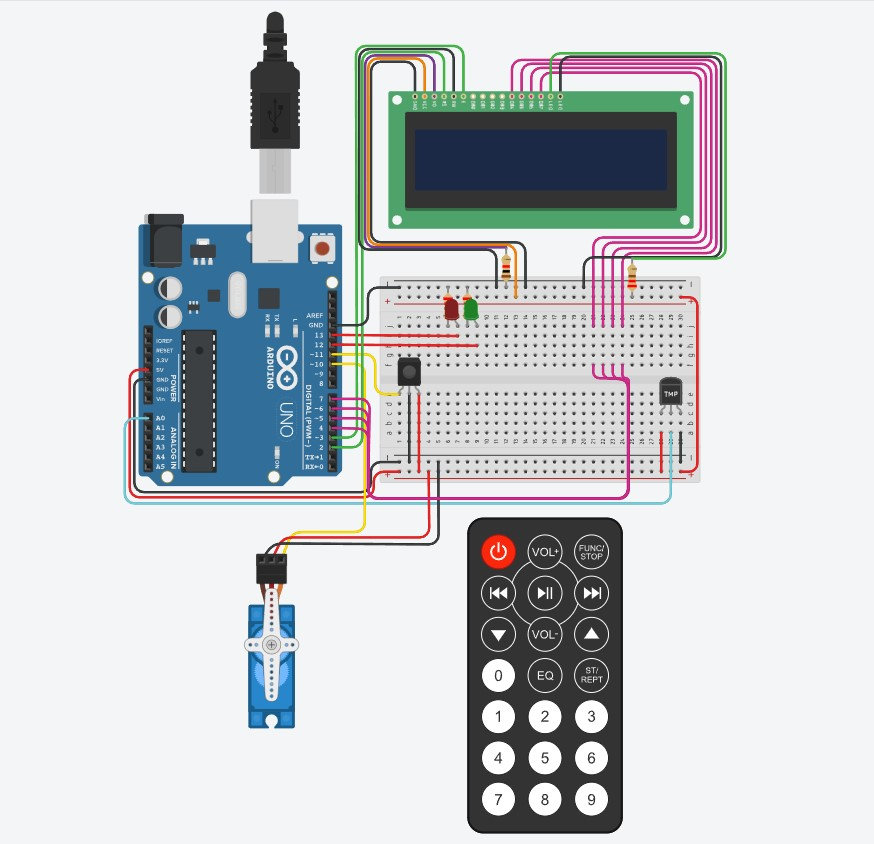
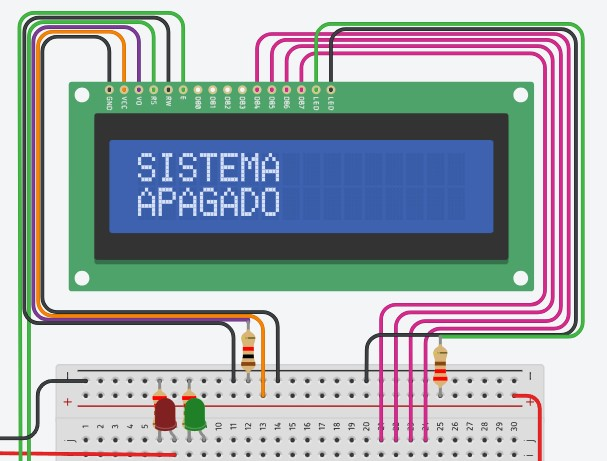
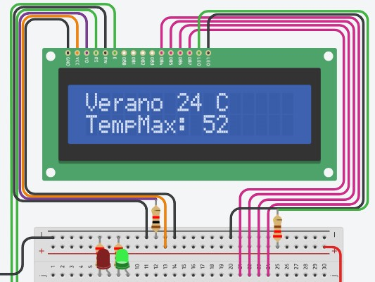
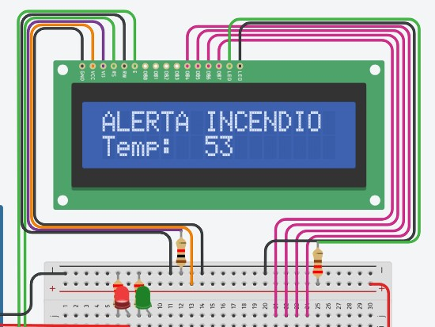
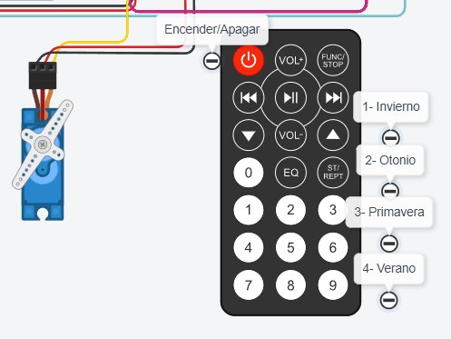
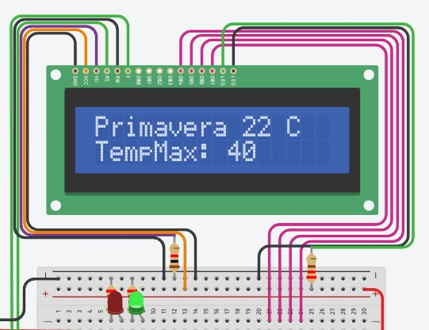

# Parcial (Parte práctica)
-------------------------
## Proyecto: SISTEMA DE INCENDIO

imagen de Tinkercad:

## Alumno:  Josue Damacio

### Descripción:
#### Este proyecto tiene el objetivo de diseñar un sistema de incendio. El mismo detecta cambios de temperatura y esto activa un servo en caso de incendio mostrando una alerta, además mostrará la temperatura actual y la estacion del año.
-------------------------

## Bucle del sistema

* #### Manejo General

en el void loop cada medio segundo se detecta si la flag sistema ha cambiado usando la funcion "estado_sistema", para realizar distintas cosas dependiendo si está en HIGH o LOW

~~~
void loop()
{
  
  if (IrReceiver.decode())
  {
    estado_sistema();
    calcular_estacion();
    IrReceiver.resume();
  }

  if (flag_sistema == LOW)
  {
    mensaje_sistema_apagado();
    servo_desactivado();
    digitalWrite(led_incendio_inactivo, LOW);
    digitalWrite(led_incendio_activo, LOW);
  }
  else if (flag_sistema == HIGH)
  {
    temperatura_actual = analogRead(A0);
    temperatura_actual = map(temperatura_actual, 20, 358, -40, 125);

    estado_incendio();
  }
  delay(500);
}
~~~

en caso de estar apagado, el servo se mantiene en posición de 0 grados y muestra este mensaje mientras ambos leds (rojo y verde) se apagan 

al presionarse el btn_prende_apaga por primera vez, el sistema se enciende y muestra en el LCD la estación del año por defecto que puede modificarse con el control remoto con los botones 1, 2, 3 y 4 (invierno, otoño, primavera o verano respectivamente). Cada estación tendrá su propia temperatura maxima que mientras no supere no se activará la alerta y el led verde estará activo mostrando que es seguro:

Pero si se sobrepasa ese maximo de temperatura, el sistema de incendio se activará prendiendo ahora el led rojo y mostrando el mensaje de alerta junto a la temperatura actual (mayor a el maximo establecido) mientras el servo se mueve continuamente:

## Funciones Principales:

* #### estado_sistema

Esta función usa el valor actual de la flag para hacerla cambiar, por lo que si el sistema estaba apagado lo enciende y si estaba encendido lo apaga. Esto lo hace si el boton de power es pesionado:

~~~
void estado_sistema()
{
  if (IrReceiver.decodedIRData.decodedRawData == btn_encender_apagar && flag_sistema == LOW)
  {
    flag_sistema = HIGH;
  }
  else if (IrReceiver.decodedIRData.decodedRawData == btn_encender_apagar && flag_sistema == HIGH)
  {
    flag_sistema = LOW;
  }
}
~~~

* #### calcular_estacion

Cuando se detecta la presion de uno de estos 4 botones, se le asigan un nuevo valor a la varaible estación y temp_maxima, esta ultima se usa en conjunto con la temperatura actual para determinar el estado del incendio:

~~~
void calcular_estacion()
{
  if (IrReceiver.decodedIRData.decodedRawData == btn_1)
  {
    estacion = "Invierno";
    temp_maxima = 28;
  }
  else if (IrReceiver.decodedIRData.decodedRawData == btn_2)
  {
    estacion = "Otonio";
    temp_maxima = 32;
  }
  else if (IrReceiver.decodedIRData.decodedRawData == btn_3)
  {
    estacion = "Primavera";
    temp_maxima = 40;
  }
  else if (IrReceiver.decodedIRData.decodedRawData == btn_4)
  {
    estacion = "Verano";
    temp_maxima = 52;
  }
}
~~~

* #### estado_incendio

Esta funcion es la encargada de llamar a las funciones de movimiento del servo y prender la led roja si el estado de la temperatura actual es mayor al maximo y el sistema está encendido. En caso contrario solo se prende el led verde y el servo se mantiene desactivado mostrando la estación actual en lugar de la alerta

~~~
void estado_incendio()
{
  if (temperatura_actual > temp_maxima && flag_sistema == HIGH)
  {
    digitalWrite(led_incendio_activo, HIGH);
    digitalWrite(led_incendio_inactivo, LOW);
    servo_activado();
    mensaje_incendio();
    flag_incendio = HIGH;
  }
  else if (temperatura_actual < temp_maxima)
  {
    digitalWrite(led_incendio_activo, LOW);
    digitalWrite(led_incendio_inactivo, HIGH);
    servo_desactivado();
    flag_incendio = LOW;
    mostrar_estacion_LCD();
  }
}
~~~

-------------------------

## Funciones Secundarias:

* ### Mensajes en LCD

Este mensaje inicial solo se muestra cuando la flag_sistema está en LOW (al apagar el sistema):
~~~
void mensaje_sistema_apagado()
{
  LCD.clear();
  LCD.print("SISTEMA");
  LCD.setCursor(0, 1);
  LCD.print("APAGADO");
}
~~~
Al determinarse la **estación** en la función "calcular_estacion", su temperatura maxima, nombre y temperatura actual se imprimen con el formato siguiente:
~~~
void mostrar_estacion_LCD()
{
  LCD.clear();
  LCD.print(estacion);
  LCD.print(" ");
  LCD.print(temperatura_actual);
  LCD.print(" C");
  LCD.setCursor(0, 1);
  LCD.print("TempMax: ");
  LCD.print(temp_maxima);
}
~~~
El siguiente mensaje se muestra cuando el incendio está en curso:
~~~
void mensaje_incendio()
{
  LCD.clear();
  LCD.print("ALERTA INCENDIO");
  LCD.setCursor(0, 1);
  LCD.print("Temp:  ");
  LCD.print(temperatura_actual);
}
~~~

* ### Movimiento del Servo

el servo solo tiene 2 funciones, una se encarga de hacer moviminetos en angulos preestablecidos y otra que hace que este de detenga en 0 grados, este se activa en caso de incendio, si el sistema está encendido o se desactiva en caso contrario:
~~~
void servo_activado()
{
  if (flag_sistema == HIGH)
  {
    servo_alarma.write(20);
    delay(500);
    servo_alarma.write(90);
    delay(500);
    servo_alarma.write(180);
    delay(500);
    servo_alarma.write(90);
    delay(500);
    servo_alarma.write(20);
  }
}
~~~
~~~
void servo_desactivado()
{
  servo_alarma.write(0);
}
~~~

## DIAGRAMA ESQUEMATICO:

### Link del proyecto 🎨
- [link_tinkercad](https://www.tinkercad.com/things/3iVUNYAlANp)